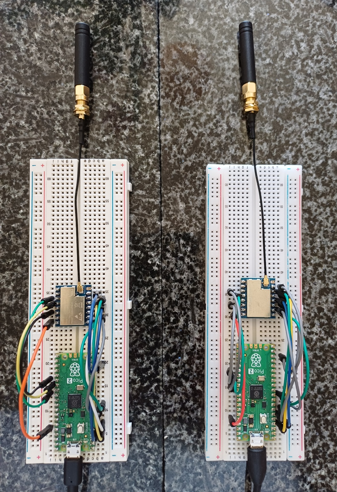

# Pi Pico Core1262-868M HF Sample Code

This is some experimental work to see what can be achieved with [RadioLib](https://github.com/jgromes/RadioLib) on a Pico Pi wired to a [Waveshare Core1262-868M HF](https://www.waveshare.com/wiki/Core1262-868M) radio module.

The [Waveshare Core1262-868M HF](https://www.waveshare.com/wiki/Core1262-868M) radio module is of interest as it contains a TCXO, which allows the stable transmission of long packets (>80 bytes). This project tests the transmission of 255 byte packets.

The objective is a minimal setup to demonstrate transmission and reception.

The project builds using the [PicoSDK](https://github.com/raspberrypi/pico-sdk).

If you can see mistakes or are able to suggest improvements please raise an issue; it would be nice to if this repository was useful to people other than just myself. 


 
## Core1262 Module
The [Core1262 module](https://www.waveshare.com/wiki/Core1262-868M) contains:
* An [SX1262 radio module](https://files.waveshare.com/upload/e/e1/DS_SX1261-2_V1.2.pdf)
* A temperature compensated crystal oscillator (TCXO)
* An [RTC6603SP SPDT antenna switch](https://files.waveshare.com/upload/c/c6/Datasheet-RTC6603SP-RichWave.pdf)
* Some RF conditioning circuitry

I *believe*:
* SX1262 DIO1 is routed solely to the DIO1 module pin 
* SX1262 DIO2 is routed solely to the DIO2 module pin 
* SX1262 DIO3 is used to enable the TCXO (it is connected to the Vcc pin via a ferrite).

The [RTC6603SP SPDT antenna switch](https://files.waveshare.com/upload/c/c6/Datasheet-RTC6603SP-RichWave.pdf) has
two control lines (RXEN and TXEN) which are exposed on the module. According to the datasheet, they are used as follows:

| RXEN | TXEN | Operation |
|------|------|-----------|
| H    | L    | Receive   |
| L    | H    | Transmit  |

Unlike some SX1262 designs, the RF switch is NOT controlled by DIO2.
Instead, the module exposes RXEN and TXEN directly, so two GPIOs must be used.

RadioLib supports this via:
```cpp
radio.setRfSwitchPins(rxEnPin, txEnPin);
```

## Wiring
The Pi Pico communicates with the Core1262 over SPI, and some extra GPIO pins to for flow control and antenna TX/RX.

The sample code links the Pico and Radio module on SPI 0 as follows:

| Pico GPIO | Pico SPI0 | Core1262 | SX1262      |
|-----------|-----------|----------|-------------|
| GPIO2     | SPI0 CLK  | CLK      | SX1262 CLK  |
| GPIO3     | SPI0 TX   | MOSI     | SX1262 MOSI |
| GPIO4     | SPI0 RX   | MISO     | SX1262 MISO |
| GPIO5     | SPI0 CSn  | CS       | SX1262 CS   |

The remaining SX1262 connections are as follows:

| Pico GPIO | Core1262 | SX1262       |
|-----------|----------|--------------|
| GPIO6     | RESET    | SX1262 RESET |
| GPIO7     | BUSY     | SX1262 BUSY  |
| GPIO20    | DIO1     | SX1262 DIO1  |

Antenna control:

| Pico GPIO | Core1262 | RTC6603SP    |
|-----------|----------|--------------|
| GPIO21    | TXEN     | V2           |
| GPIO22    | RXEN     | V1           |

## Build
Both the RadioLib repository and this repository need to be fetched to a common parent folder:
```sh
git clone git@github.com:jgromes/RadioLib.git
git clone git@github.com:fruit-bat/pico-radiolib-core1262-hf.git
cd pico-radiolib-core1262-hf
```

There are a couple of script to help build the project:
```sh
./clean.sh
./build.sh
```

Note that, ```build.sh``` is currently configured for a Pico2 board.

If the build succeeds, it will create two executables, one configured to send, and one set to receive:
| Name | Action |
|------|--------|
| pico-sx1262-hx-rx.uf2 | Continuously listen for incoming messages |
| pico-sx1262-hx-tx.uf2 | Periodically transmit a message |

These need to be copied onto the Pi Pico boards.
On the receiver:
```sh
cp pico-sx1262-hx-rx.uf2 /media/neo/RP2350/
```
On the transmitter:
```sh
cp pico-sx1262-hx-tx.uf2 /media/neo/RP2350/
```

## Expected results
The transmitter sends a 255 byte message containing the text:

*Lorem ipsum dolor sit amet, consectetur adipiscing elit. Sed lorem magna, feugiat eget augue id, ultrices semper lorem. Pellentesque vitae enim mauris. Nam at massa ac urna suscipit iaculis. Cras ultrices magna sit amet est volutpat vestibulum erat curae.*

You can connect to the serial over USB device and you should see the following:
```
$ tio /dev/ttyACM0
[11:40:32.973] tio v2.7
[11:40:32.973] Press ctrl-t q to quit
[11:40:32.974] Connected
[SX1262] Initializing ... 
Initialise success!
[SX1262] Transmitting packet ... success!
[SX1262] Transmitting packet ... success!
[SX1262] Transmitting packet ... success!

```

On the receiver side:
```
$ tio /dev/ttyACM1
[11:41:15.709] tio v2.7
[11:41:15.709] Press ctrl-t q to quit
[11:41:15.710] Connected
[SX1262] Initializing ... 
Initialise success!
[SX1262] Waiting for incoming transmission ... 0 success!
[SX1262] HEX: 4C 6F 72 65 6D 20 69 70 73 75 6D 20 64 6F 6C 6F 72 20 73 69 74 20 61 6D 65 74 2C 20 63 6F 6E 73 65 63 74 65 74 75 72 20 61 64 69 70 69 73 63 69 6E 67 20 65 6C 69 74 2E 20 53 65 64 20 6C 6F 72 65 6D 20 6D 61 67 6E 61 2C 20 66 65 75 67 69 61 74 20 65 67 65 74 20 61 75 67 75 65 20 69 64 2C 20 75 6C 74 72 69 63 65 73 20 73 65 6D 70 65 72 20 6C 6F 72 65 6D 2E 20 50 65 6C 6C 65 6E 74 65 73 71 75 65 20 76 69 74 61 65 20 65 6E 69 6D 20 6D 61 75 72 69 73 2E 20 4E 61 6D 20 61 74 20 6D 61 73 73 61 20 61 63 20 75 72 6E 61 20 73 75 73 63 69 70 69 74 20 69 61 63 75 6C 69 73 2E 20 43 72 61 73 20 75 6C 74 72 69 63 65 73 20 6D 61 67 6E 61 20 73 69 74 20 61 6D 65 74 20 65 73 74 20 76 6F 6C 75 74 70 61 74 20 76 65 73 74 69 62 75 6C 75 6D 20 65 72 61 74 20 63 75 72 61 65 2E 
[SX1262] ASCII: Lorem ipsum dolor sit amet, consectetur adipiscing elit. Sed lorem magna, feugiat eget augue id, ultrices semper lorem. Pellentesque vitae enim mauris. Nam at massa ac urna suscipit iaculis. Cras ultrices magna sit amet est volutpat vestibulum erat curae.
[SX1262] RSSI:		-30.000000 dBm
[SX1262] SNR:		12.250000 dB
[SX1262] Frequency error:	-96.875000 Hz
[SX1262] Waiting for incoming transmission ... 
```

When working correctly, you should see values similar to:
```
RSSI: -20 to -40 dBm (close range)
SNR:  10+ dB
Frequency error: < 1 kHz
```

### RSSI (Received Signal Strength Indicator)
RSSI measurements are represented in decibels relative to a milliwatt (because it is a logarithmic scale, a difference of 3dB represents roughly a doubling/halving of power).

| RSSI              | Meaning                      |
|-------------------|------------------------------|
| -20 to -40 dBm	| Extremely strong (same room) |
| -50 to -80 dBm	| Good link                    |
| -90 to -120 dBm	| Weak / long range            |

### SNR (Signal to Noise Ratio)
| SNR      | Meaning                               |
|----------|---------------------------------------|
| >10 dB   | Very clean signal                     |
| 0–10 dB  | Normal                                |
| <0 dB    | Weak but still decodable (LoRa magic) |

### Frequency Error
Anything less than 1Khz is fine. To put the above example into perspective:

*96.875Hz / 867.2Mhz = 0.11 ppm*

## Working configuration for the Core1262-868M HF
These are sample settings that are enough to get transmission and reception working:
```cpp
  // Configure the pins that are used for switching between RX and TX modes.
  // These pins control the RF antenna switch on the Core1262-868M-hf LoRa module.
  // It contains an RTC6603SP SPDT antenna switch
  radio.setRfSwitchPins(LORA_RXEN, LORA_TXEN);

  int16_t state = radio.begin(
    867.2, // frequency in MHz
    125.0, // bandwidth in kHz
    8,     // spreading factor, 7-12 for LoRa
    5,     // coding rate denominator, 4-8 (4 means no coding)
    0x12,  // sync word, 0x12 for private LoRa networks, 0x34 for public LoRa networks
    7,     // output power in dBm, -9 to +22
    18,    // preamble length in symbols
    1.7,   // TCXO voltage
    true   // Use LDO regulator or DC-DC regulator (both seem to work)
  );
```

## Notes
Both the LDO and DC-DC voltage regulation modes work fine. Perhaps there are circumstances where one is better than the other, but superficially I get similar results. 

I'm not sure if the TXCO voltage should be set to 1.7v or 1.8v. I currently have it running at 1.7v

RadioLib does not seem to set the initial state of the antenna swtich pins RXEN and TXEN. This makes me nervous, so I have added a line to ```Module.cpp``` as follows:
```cpp
void Module::setRfSwitchPins(uint32_t rxEn, uint32_t txEn) {
  // This can be on the stack, setRfSwitchTable copies the contents
  const uint32_t pins[] = {
    rxEn, txEn, RADIOLIB_NC, RADIOLIB_NC, RADIOLIB_NC,
  };
  
  // This must be static, since setRfSwitchTable stores a reference.
  static const RfSwitchMode_t table[] = {
    { MODE_IDLE,  {this->hal->GpioLevelLow,  this->hal->GpioLevelLow} },
    { MODE_RX,    {this->hal->GpioLevelHigh, this->hal->GpioLevelLow} },
    { MODE_TX,    {this->hal->GpioLevelLow,  this->hal->GpioLevelHigh} },
    END_OF_MODE_TABLE,
  };
  setRfSwitchTable(pins, table);
}

```
is now:
```cpp
void Module::setRfSwitchPins(uint32_t rxEn, uint32_t txEn) {
  // This can be on the stack, setRfSwitchTable copies the contents
  const uint32_t pins[] = {
    rxEn, txEn, RADIOLIB_NC, RADIOLIB_NC, RADIOLIB_NC,
  };
  
  // This must be static, since setRfSwitchTable stores a reference.
  static const RfSwitchMode_t table[] = {
    { MODE_IDLE,  {this->hal->GpioLevelLow,  this->hal->GpioLevelLow} },
    { MODE_RX,    {this->hal->GpioLevelHigh, this->hal->GpioLevelLow} },
    { MODE_TX,    {this->hal->GpioLevelLow,  this->hal->GpioLevelHigh} },
    END_OF_MODE_TABLE,
  };
  setRfSwitchTable(pins, table);
  // set the initial state to RX (some switches do not have an idle state)
  setRfSwitchState(MODE_RX);
}
```
I may just be missing something here, I will try to get round to asking the author.

In RadioLib there does not seem to be a way to initialise the sx1262 without telling it to use DIO2 as antenna control. See ```SX126x.cpp```:
```cpp
int16_t SX126x::begin(uint8_t cr, uint8_t syncWord, uint16_t preambleLength, float tcxoVoltage, bool useRegulatorLDO) {
  // BW in kHz and SF are required in order to calculate LDRO for setModulationParams
  // set the defaults, this will get overwritten later anyway
  this->bandwidthKhz = 500.0;
  this->spreadingFactor = 9;

...

  // set publicly accessible settings that are not a part of begin method
  state = setCurrentLimit(60.0);
  RADIOLIB_ASSERT(state);

  state = setDio2AsRfSwitch(true);
  RADIOLIB_ASSERT(state);

  state = setCRC(2);
  RADIOLIB_ASSERT(state);

  state = invertIQ(false);
  RADIOLIB_ASSERT(state);

  return(state);
}
```
Now, it's possible this does not matter, but it would be nice for this value, along with the other hard coded ones passed in to begin with defaults. Depending on what external circuitry is added to the module, enabling DIO2 as an output, if only briefly, might cause damage.

The above code also enables CRC. In Lora mode the radio either has CRC enabled or not. Passing 0 to setCRC disables CRC. 

For now I have disabled the use of DIO2 as follows:
```cpp
int16_t SX126x::begin(uint8_t cr, uint8_t syncWord, uint16_t preambleLength, float tcxoVoltage, bool useRegulatorLDO) {
  // BW in kHz and SF are required in order to calculate LDRO for setModulationParams
  // set the defaults, this will get overwritten later anyway
  this->bandwidthKhz = 500.0;
  this->spreadingFactor = 9;

...

  // set publicly accessible settings that are not a part of begin method
  state = setCurrentLimit(60.0);
  RADIOLIB_ASSERT(state);

  state = setDio2AsRfSwitch(false); // Was true. Should be a parameter?
  RADIOLIB_ASSERT(state);

  state = setCRC(2);
  RADIOLIB_ASSERT(state);

  state = invertIQ(false);
  RADIOLIB_ASSERT(state);

  return(state);
}
```

## Core1262-868M HF pinout
With the module viewed from the top with the antenna connection bottom left:
|  |      | |      |  |
|--|------|-|------|--|
| 1| BUSY | | 3V3  |16|
| 2| RESET| | GND  |15|
| 3| MISO | | DIO1 |14|
| 4| MOSI | | DIO2 |13|
| 5| CLK  | | TXEN |12|
| 6| CS   | | RXEN |11|
| 7| GND  | | GND  |10|
| 8| ANT  | | GND  | 9| 

## Pi Pico pinout


## Module circuit diagram
https://files.waveshare.com/upload/c/c1/CoreSX1262_Sch.pdf

## Troubleshooting
* Transmitter gives error ```Error code 5 (TX timeout)```
  * Check DIO2 wiring

## References
https://www.waveshare.com/wiki/Core1262-868M<br/>
https://github.com/jgromes/RadioLib/discussions/1556<br/>
https://files.waveshare.com/upload/c/c6/Datasheet-RTC6603SP-RichWave.pdf<br/>
https://www.waveshare.com/wiki/Core1262-868M<br/>
https://files.waveshare.com/upload/e/e1/DS_SX1261-2_V1.2.pdf<br/>
https://github.com/jgromes/RadioLib/discussions/1135<br/>
https://github.com/MarusGradinaru/LoRa-Test/blob/main/src/main.cpp<br/>
